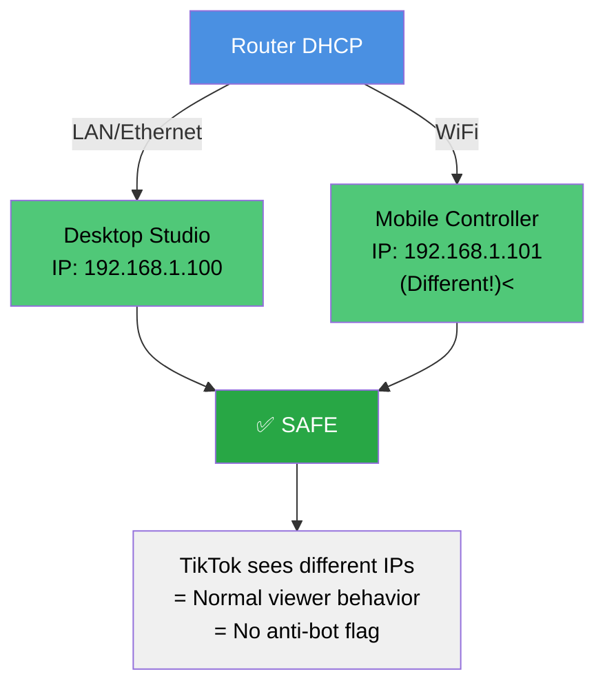
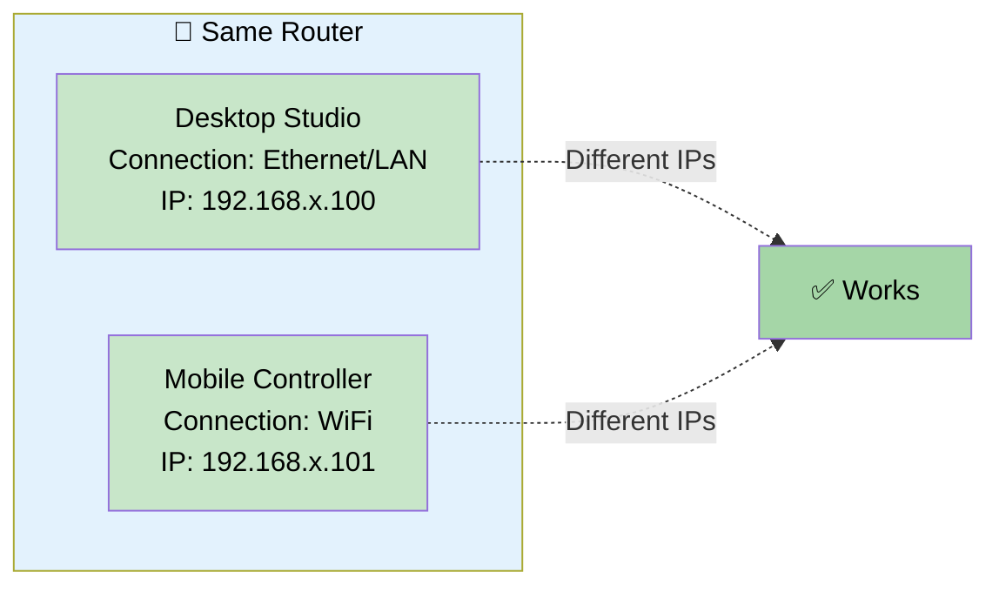
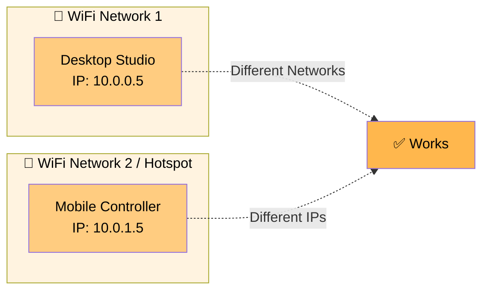
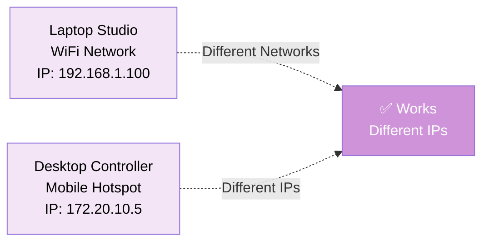
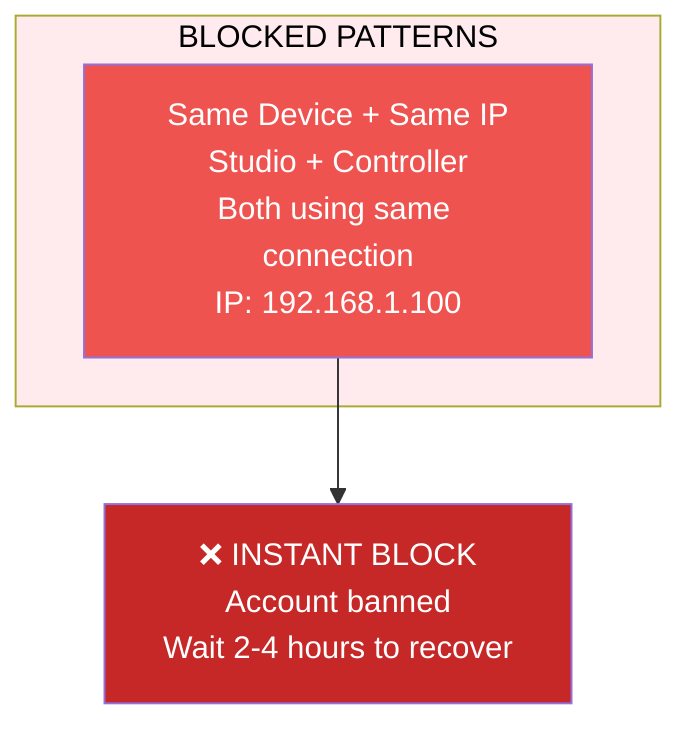
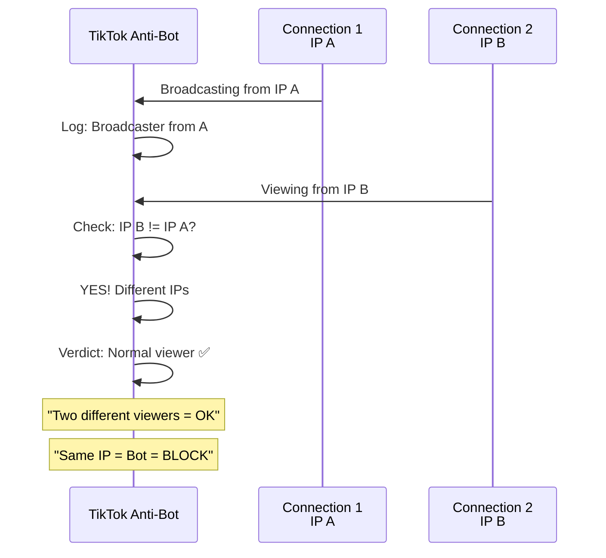
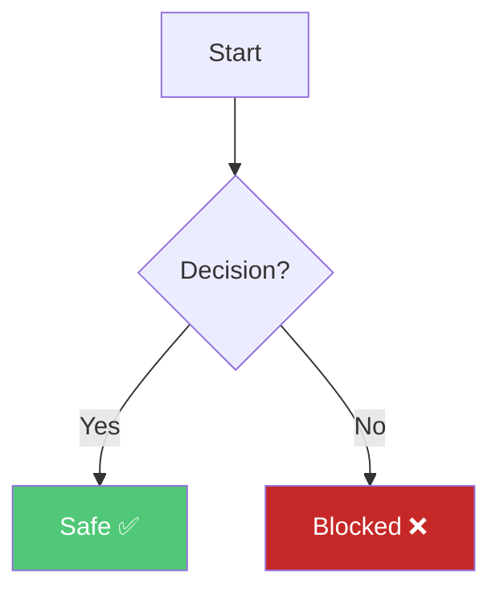

# TikTokLive Python Library - AI Coding Agent Instructions

## Project Overview
This is a Python library for connecting to TikTok's LIVE service to receive real-time livestream events (comments, gifts, joins, etc.) via TikTok's internal Webcast push service. It's a reverse-engineered implementation—not an official API.

## Architecture

### Core Components
- **`TikTokLive/client/`**: Client implementation with dual connection modes
  - `client.py`: High-level `TikTokLiveClient` with event handling & message parsing
  - `base.py`: `BaseClient` handles websocket/polling connections, room management
  - `config.py`: Default HTTP params & headers mimicking browser behavior
  - `httpx.py`: HTTP client wrapper for TikTok API requests
- **`TikTokLive/types/`**: Event schemas & data objects
  - `events.py`: All event classes (CommentEvent, GiftEvent, etc.) inherit from `AbstractEvent`
  - `objects.py`: Data structures (User, Gift, Avatar, etc.)
  - `errors.py`: Custom exceptions for connection failures
- **`TikTokLive/proto/`**: Protobuf message handling
  - `tiktok_schema_pb2.py`: Generated protobuf definitions (don't edit manually)
  - `utilities.py`: Deserializes binary protobuf messages to dicts

### Connection Flow
1. Client connects using `unique_id` (TikTok username)
2. Initial HTTP request to `webcast/fetch/` establishes room connection
3. If available, upgrades to websocket via `wsUrl` + `wsParam` from response
4. Falls back to long polling (`im/fetch/`) if websocket unavailable
5. Cursor-based pagination: `cursor` param tracks message position

## Key Patterns

### Event-Driven Architecture
```python
# Decorator pattern for event handlers
@client.on("comment")
async def on_comment(event: CommentEvent):
    print(f"{event.user.nickname} -> {event.comment}")

# Callback registration pattern
client.add_listener("gift", on_gift)
```

All events inherit from `AbstractEvent` with a `name` attribute matching the event type. Events contain `_as_dict` attribute with raw payload.

### Gift Handling (Critical Pattern)
Gifts have **streakable** behavior—type 1 gifts can repeat in streaks:
```python
if event.gift.streakable:
    if not event.gift.streaking:  # Streak ended
        print(f"{event.gift.repeat_count}x {event.gift.extended_gift.name}")
else:  # Non-streakable gift
    print(f"Received {event.gift.extended_gift.name}")
```

### Protobuf Message Parsing
Messages arrive as binary protobuf, deserialized in `proto/utilities.py`:
- `deserialize_message()`: Converts protobuf bytes to dict
- Specific message types (WebcastChatMessage, WebcastGiftMessage, etc.) get additional parsing
- All messages in WebcastResponse have nested `binary` field that gets recursively deserialized

## Client Configuration

### Initialization Options
- `unique_id`: TikTok username (required, auto-normalized with `@`)
- `websocket_enabled=True`: Controls websocket vs polling-only mode
- `process_initial_data=True`: Whether to emit cached events from initial connection
- `enable_extended_gift_info=True`: Fetches gift images/metadata (stored in `available_gifts` dict)
- `sign_api_key`: Optional API key for increased rate limits (contact maintainer)
- `lang="en-US"`: Changes language for extended gift info

### Running the Client
```python
client.run()  # Blocking, starts event loop
await client.start()  # Non-blocking alternative
```

## Custom Utility Library (examples/nandur_lib.py)
Contains project-specific helpers for Indonesian TikTok streams:
- `show_event_picture()`: Downloads & saves profile pics/gift icons
- `save_tiktok_event_to_text_file()`: Persists event data to text files
- `read_username()`: Uses gTTS for text-to-speech in Indonesian (`lang='id'`, `tld='co.id'`)
- `tiktok_id_target()`: Reads target username from `config.ini` (`[TikTok_data]` section)

## Development Notes

### Error Handling
- Websocket errors are logged but don't crash—falls back to polling automatically
- Connection errors raise custom exceptions: `AlreadyConnecting`, `LiveNotFound`, `FailedConnection`
- Register `@client.on("error")` handler to catch runtime errors, otherwise they're logged via `logging.error()`

### Testing Event Handlers
Use `debug=True` when creating client to emit all raw payloads to a `debug` event:
```python
client = TikTokLiveClient("@username", debug=True)
@client.on("debug")
async def on_debug(event):
    print(event.as_dict)  # Raw protobuf data
```

### Examples Directory Structure
- `basic.py`: Minimal setup template
- `gifts.py`: Demonstrates streak handling pattern
- `pygamex.py`: Real-time pygame UI integration
- `nandur_lib.py`: Custom utilities for Indonesian streams
- `DonationSounds/`: Audio playback for donations

## Common Pitfalls
- Don't call protobuf parsing directly—use `from_dict_plus()` from `proto/utilities.py`
- Websocket disconnects set `self.__is_ws_upgrade_done = False` but don't stop polling
- `room_id` only available after successful connection via `client.room_id`
- Event handlers **must be async** when using decorator/listener patterns
- Session IDs expire—handle `InvalidSessionId` exception for long-running connections

## TikTok Anti-Bot / Blocking Behavior

### ⚠️ CRITICAL: IP-Based Detection

TikTok **blocks accounts that use SAME IP for broadcasting and viewing simultaneously.**

### Root Cause
TikTok detects multiple concurrent connections from **same IP address**:
- **Connection 1**: TikTok Live Studio (broadcaster)
- **Connection 2**: TikTokLive library (viewer bot)
- **Same IP**: Anti-bot system triggers = **BLOCKED**

### ✅ CONFIRMED WORKING Solution
**Key Insight: Different Connection Types = Different IPs**



### Safe Configuration Patterns

**Pattern 1: Same Router, Different Connection Types** ✅


**Pattern 2: Different WiFi Networks**


**Pattern 3: Mobile Hotspot**


### ❌ Configurations That Get BLOCKED



### Why Different IPs Work



### Recovery If Blocked

1. **Wait 2-4 hours** after streaming ends
2. **Restart router** (obtain new IP address via DHCP)
3. **Use VPN** to get completely different IP
4. Or **Switch to Mobile streaming** (confirmed working solution)

### Key Takeaway

> **TikTok blocks based on IP address, not device or router.**  
> **Different IPs = Safe ✅**  
> **Same IP = Blocked ❌**

## AI Agent Behavior Guidelines

### ⚠️ CRITICAL - DO NOT:
1. **Never perform destructive operations** on crucial/core files without explicit user approval
   - Don't delete core library files
   - Don't modify critical configs without asking
   - Don't break existing functionality

2. **Never hardcode credentials, API keys, or secrets**
   - ALWAYS store sensitive data in `.env` file
   - Use `python-dotenv` to load environment variables
   - Never commit secrets to git
   - Never log sensitive information

3. **Never spam markdown/documentation files**
   - Only create/modify docs when explicitly requested
   - Don't auto-generate documentation without permission
   - Consolidate updates into single files when possible

4. **Never commit or push to git automatically**
   - Always wait for explicit `git add`, `commit`, or `push` request
   - Ask for confirmation before pushing
   - Inform user of pending changes that need manual commit

### ✅ BEST PRACTICES:
- Ask for confirmation before making breaking changes
- Always suggest alternatives before deletion
- Keep sensitive data in `.env` (add to `.gitignore`)
- Report what would change before doing it
- Wait for explicit user permission for git operations
### ⚠️ TERMINAL SYNTAX - POWERSHELL ONLY

**ALWAYS use PowerShell syntax. User is on Windows with PowerShell.**

#### ❌ WRONG - Never use Bash/Unix syntax:
```powershell
# DON'T DO THIS:
echo "text" | command          # Unix pipe
command1 && command2           # Unix AND
command1; command2             # Unix semicolon chaining (wrong context)
head -20                        # Unix command
cat file.txt                    # Unix command
export VAR=value              # Unix export
timeout 5 command              # Windows timeout command syntax is different
```

#### ✅ CORRECT - Use PowerShell syntax:
```powershell
# DO THIS INSTEAD:
Write-Output "text" | command                    # PowerShell pipe (same as Bash)
command1 ; command2                              # PowerShell semicolon (correct!)
Select-Object -First 20                          # PowerShell equivalent of head
Get-Content file.txt                             # PowerShell equivalent of cat
$env:VAR = "value"                              # PowerShell environment variable
Start-Sleep -Seconds 5; command                  # PowerShell sleep + command

# More examples:
ls → Get-ChildItem
cd → Set-Location or Push-Location/Pop-Location
mkdir → New-Item -ItemType Directory
cp → Copy-Item
mv → Move-Item
rm → Remove-Item
grep → Select-String
```

#### 📋 COMMON MISTAKES TO AVOID:

1. **Piping to `head`** ❌
   ```powershell
   # WRONG:
   python script.py 2>&1 | head -20
   
   # CORRECT:
   python script.py 2>&1 | Select-Object -First 20
   ```

2. **Using `&&` for chaining** ❌
   ```powershell
   # WRONG:
   python script.py && echo "Done"
   
   # CORRECT:
   python script.py ; echo "Done"
   # OR
   python script.py; Write-Output "Done"
   ```

3. **Using `echo` instead of `Write-Output`** ❌
   ```powershell
   # WRONG (echo exists but works differently):
   echo "test" > file.txt
   
   # CORRECT:
   "test" | Out-File file.txt
   # OR for simple write:
   Write-Output "test"
   ```

4. **Using `timeout` incorrectly** ❌
   ```powershell
   # WRONG:
   timeout 5 python script.py
   
   # CORRECT:
   Start-Process python -ArgumentList "script.py" -Wait
   # Or use Job-based approach for more control
   ```

5. **Using `<` for input redirection** ❌
   ```powershell
   # WRONG (not supported):
   python script.py < input.txt
   
   # CORRECT:
   Get-Content input.txt | python script.py
   ```

#### 🎯 TERMINAL COMMAND BEST PRACTICES:

When running terminal commands:
1. **Always check if command exists in PowerShell first**
2. **Use `Get-*` cmdlets for retrieval** (Get-ChildItem, Get-Content, etc.)
3. **Use pipes `|` correctly** (PowerShell pipes work like Bash)
4. **Use semicolons `;` for command chaining**
5. **Use `Write-Output` or `-` for output** (not `echo`)
6. **Avoid external tools** unless PowerShell equivalent doesn't exist

#### 📌 SAFE POWERSHELL PATTERNS:

```powershell
# List files
Get-Item path\to\files | Select-Object Name, Length, LastWriteTime

# Get first/last N lines
command-output | Select-Object -First 20
command-output | Select-Object -Last 10

# Filter output
command-output | Where-Object {$_.Length -gt 1000}

# Format table
command-output | Format-Table -AutoSize

# Combine operations
Get-ChildItem | Where-Object {$_.Extension -eq ".py"} | Select-Object Name
```

## Git & Commit Policy - STRICT HUMAN-IN-THE-LOOP ⚠️

### CRITICAL RULES - DO NOT VIOLATE:

1. **NEVER make ANY git commits without explicit user request**
   - User must explicitly say "ready to commit", "commit this", or similar approval
   - Before committing, ALWAYS ask: "Ready to commit this change?" and wait for user response
   - If unsure whether user requested commit, ask confirmation first
   - **This is non-negotiable** - human approval is mandatory for ALL commits

2. **NEVER push code to remote without explicit user request**
   - Same human-in-the-loop requirement as commits
   - Always ask "Ready to push?" before pushing
   - Inform user of pending commits that need pushing

3. **NEVER reference or commit changes involving library/auto-generated code**
   - Exclude from git operations:
     - `node_modules/` - DO NOT commit, DO NOT analyze, DO NOT reference
     - `__pycache__/` - DO NOT commit, DO NOT analyze
     - `.egg-info/`, `dist/`, `build/` - DO NOT touch
     - Auto-generated protobuf files (`tiktok_schema_pb2.py` - only if source `.proto` changed)
     - Compiled files, vendor directories, generated API stubs
   - If code changes involve libraries, only show user the SOURCE file that imports/uses them
   - DO NOT include node_modules changes in commit messages or pull request descriptions

4. **Inform user of pending changes BEFORE committing**
   - Run `git status` to show what would be committed
   - Show user the diff/summary of changes
   - Wait for explicit user approval
   - Be specific: "I'm about to commit changes to X, Y, Z files. OK to proceed?"

### VERIFICATION WORKFLOW:

```
You: Create/modify code
   ↓
You: Review changes locally with `git status`
   ↓
User: "Ready to commit"
   ↓
You: Ask confirmation with summary
   ↓
User: "Yes, commit"
   ↓
You: Execute git commit + push (if requested)
```

**Example Interaction:**

❌ WRONG:
```
[Agent modifies file] → [Agent runs git commit] → User says "why did you commit?!"
```

✅ CORRECT:
```
[Agent modifies file]
Agent: "I've updated main.js to add X functionality. Changes are in racing_app/overlay_electron/main.js. Ready to commit?"
User: "Yes, commit it"
Agent: "Committing changes with message '...'..."
[Agent runs git commit]
```

## Code Analysis Scope - Library Exclusions

### DO NOT analyze these directories:

- **`node_modules/`** - Third-party npm packages
  - NEVER read files from here
  - NEVER suggest changes to code in here
  - NEVER reference package code directly
  - Only reference if user explicitly asks about a specific package behavior
  
- **`__pycache__/`** - Python compiled files
  - Auto-generated, ignore completely
  
- **`dist/`, `build/`, `.egg-info/`** - Build outputs
  - These are auto-generated
  - Never commit or analyze
  
- **Auto-generated code files**:
  - `tiktok_schema_pb2.py` (unless `.proto` source file changed)
  - Generated API stubs
  - Compiled binaries
  
- **Lock files (indirectly)**:
  - `package-lock.json`, `poetry.lock`, `Pipfile.lock` should be in `.gitignore`
  - DO NOT analyze these for code patterns
  - Use them only to understand dependencies, not for code review

### FOCUS ON USER CODE ONLY:

When analyzing code, focus on:
- ✅ User-authored source files (`.py`, `.js`, `.ts`)
- ✅ Configuration files created by user (`config.json`, `config.ini`, etc.)
- ✅ Library imports and their usage IN user code (but not library internals)
- ✅ Project structure and architecture decisions

When referencing external libraries:
- ✅ DO mention if a function is from an external library
- ✅ DO show user how to import/use it
- ✅ DO NOT copy/analyze the library implementation itself
- ✅ DO NOT include library file paths in discussions

**Example:**

❌ WRONG:
```
"Looking at node_modules/electron/lib/main.js, the window creation API works by..."
"I'll modify the lodash sorting algorithm in node_modules/lodash/..."
```

✅ CORRECT:
```
"The Electron library provides a window creation API. Your code in main.js uses it like..."
"To sort data efficiently, I'll use lodash's sort function. Here's how to use it in your code..."
```

## Documentation Standards

### Mermaid Diagrams
Use Mermaid for all diagrams and visualizations:
- **Network diagrams**: flowchart, graph
- **Sequence flows**: sequenceDiagram
- **Process flows**: flowchart (TD, LR, DL)
- **Decision trees**: flowchart with conditionals
- **Component interactions**: graph TD

**Guidelines:**
- Keep diagrams simple and clear
- Use colors to highlight important elements:
  - Green (`#50c878`, `#28a745`) = Working/Safe ✅
  - Red (`#e74c3c`, `#c62828`) = Blocked/Unsafe ❌
  - Blue (`#4a90e2`) = Neutral/Info
  - Orange (`#ff6b6b`) = Warning
- Add descriptive labels and arrows
- Include legend/explanation below if complex

**Example:**
````markdown

````

---

## Racing Game Controller Module (v2.1.0)

### Overview
The Racing Game Controller is an advanced real-time overlay system that bridges TikTok Live events with game input controls. It features multi-game support, real-time event visualization, and non-blocking IPC communication.

### Architecture

#### Core Files
- **`racing_app/racing_game_controller.py`** (@nandurstudio, 2025-12-15 → 2026-02-03)
  - Main TikTok event handler and game input controller
  - Supports WASD input for racing games (NFS, GTA, Minecraft Racing, Roblox)
  - Gift event handling with animation triggers (rose/mawar → NOS button)
  - IPC communication with Electron overlay (non-blocking threading)
  - Session statistics tracking (duration, command count, unique users)

- **`racing_app/notification_logger.py`** (@nandurstudio, 2025-12-20 → 2026-02-03)
  - Non-blocking IPC communication bridge
  - HTTP POST to Electron overlay with 0.3s timeout (fire-and-forget pattern)
  - Terminal notification logging with structured event data
  - Async thread execution prevents UI hang on rapid events

- **`racing_app/launcher.py`** (@nandurstudio, 2025-12-01 → 2026-02-03)
  - Unified entry point: Starts overlay first, then menu
  - Multi-game menu selection with async game process management
  - Graceful shutdown with proper resource cleanup
  - UTF-8 output support for Indonesian text on Windows

- **`racing_app/overlay_electron/main.js`** (@nandurstudio, 2025-11-20 → 2026-02-03)
  - Electron overlay window with global hotkey support
  - IPC server listening for game events
  - HTML overlay rendering with real-time CSS animations

- **`racing_app/live-instruction-electron.html`** 
  - UI overlay with 4 main control buttons (NGEDRIFT, KLAKSON, NOS, KAMERA)
  - CSS animations: shake effect + brightness glow (400ms duration)
  - Manual test functions: `window.testNOS()`, `window.testKlakson()`, `window.testDrift()`
  - Gift rose event listener → NOS/Nitro button animation trigger

#### Game Input Mapping
```python
{
    "like": "KEY_E",          # Like event
    "drift": "KEY_A",         # Drift button (shake + glow)
    "horn": "KEY_H",          # Klakson/horn
    "nos": "KEY_N",           # NOS/Nitro (gift rose trigger)
    "camera": "KEY_C"         # Camera angle
}
```

### Critical Patterns

#### Gift Event Handling - Rose (Mawar) to NOS Animation
```python
async def _handle_gift_event(self, event: GiftEvent):
    """
    Triggers NOS/Nitro button animation for rose gifts
    IPC data structure (non-existent attributes removed for stability):
    """
    gift_name = event.gift.name.lower() if hasattr(event.gift, 'name') else ""
    username = event.user.nickname
    
    if gift_name in self.config.get('gift_triggers', {}).get('nos', []):
        # Send non-blocking IPC event
        overlay_notif_manager.send_event(
            'gift-event',
            {'gift_name': gift_name, 'username': username}  # NO .count attribute!
        )
        logger.info(f"🌹 IPC gift-event sent for {username}")
```

#### Non-Blocking IPC Communication (Threading)
```python
# notification_logger.py
def send_event(self, event_type, data):
    def _send_async():
        try:
            # Fire-and-forget: 0.3s timeout prevents UI hang
            requests.post(
                f"http://127.0.0.1:{self.port}/event",
                json={'event': event_type, 'data': data},
                timeout=0.3
            )
        except Exception as e:
            # Silently log, don't spam on timeout
            logger.warning(f"⚠️ IPC {event_type} error: {e}")
    
    # Background thread execution
    threading.Thread(target=_send_async, daemon=True).start()
```

#### CSS Animation Chain (Shake + Glow Effect)
```css
@keyframes nos-activate {
    0%, 100% { transform: rotate(-1deg); filter: brightness(1); }
    10% { transform: rotate(2deg); filter: brightness(1.3); }
    20% { transform: rotate(-1deg); filter: brightness(1.5); }
    /* ... shake pattern */
    100% { transform: rotate(0); filter: brightness(1); }
}

/* Trigger: Add 'activated' class, remove after 400ms */
.nos-button.activated {
    animation: nos-activate 0.4s ease-in-out;
}
```

#### HTML/JS Animation Trigger
```javascript
// live-instruction-electron.html
ipcRenderer.on('gift-event', (event, eventData) => {
    const { gift_name, username } = eventData;
    
    if (gift_name === 'rose' || gift_name === 'mawar') {
        const nosButton = document.querySelector('.nos-button');
        nosButton.classList.add('activated');
        setTimeout(() => nosButton.classList.remove('activated'), 400);
        console.log(`🌹 NOS animation triggered for ${username}`);
    }
});
```

### Known Issues & Solutions

#### Issue: Gift Animation Not Triggering
**Root Cause**: TikTokLive `ExtendedGift` object lacks `count` attribute, causing IPC exception
```python
# ❌ WRONG - causes: 'ExtendedGift' object has no attribute 'count'
ipc_data = {'gift_name': gift_name, 'gift_count': event.gift.count, 'username': username}

# ✅ CORRECT - only include fields that exist
ipc_data = {'gift_name': gift_name, 'username': username}
```

#### Issue: Application Hang on Rapid Events
**Solution**: Non-blocking threading + 0.3s timeout in `notification_logger.py`
- Previous: Blocking HTTP (1.0s timeout) → hung UI on 100+ likes/sec
- Current: Threading + fire-and-forget → smooth 0.4 commands/second

#### Issue: Testing Animation Without Python Event
**Solution**: Manual test functions in overlay console
```javascript
// Press F12 → Console → type:
window.testNOS()        // Triggers NOS animation
window.testKlakson()    // Triggers KLAKSON animation
window.testDrift()      // Triggers DRIFT animation
```

### Configuration (config.json)

```json
{
  "version": "2.1.0",
  "gift_triggers": {
    "nos": ["rose", "mawar", "14"]  // Gift IDs/names that trigger NOS
  },
  "overlay": {
    "enabled": true,
    "width": 691,
    "height": 301,
    "always_on_top": true,
    "frameless": true,
    "resizable": true
  }
}
```

### Testing & Verification

**Production Test Checklist:**
- [ ] Overlay starts without errors
- [ ] TikTok gift rose (🌹) triggers NOS button animation
- [ ] Animation identical to KLAKSON (shake + brightness effect, 400ms duration)
- [ ] 248+ gifts processed without crash (proven in session: 2284.5s duration)
- [ ] No hang on rapid events (0.4 commands/sec maintained)
- [ ] Graceful disconnect: shows session statistics and returns to menu

**Debug Mode:**
```bash
python launcher.py
# Press F12 in overlay for console
# Test manual animations: window.testNOS(), window.testKlakson(), window.testDrift()
```

### Best Practices

1. **IPC Data Structure**: Only include fields confirmed to exist on event objects
2. **Threading**: Always use non-blocking threading for IPC to prevent UI hang
3. **Animation Duration**: Keep at 400ms for consistency across all buttons
4. **Error Handling**: Log warnings but don't crash on IPC failures
5. **Session Cleanup**: Properly disconnect WebSocket and cancel asyncio tasks on exit

### Version History
- **v2.1.0** (2026-02-03): Stabilized gift animation, fixed IPC exception, added manual test functions
- **v2.0.0**: Initial racing controller with multi-game support
- **v1.0.0**: Basic TikTok event integration